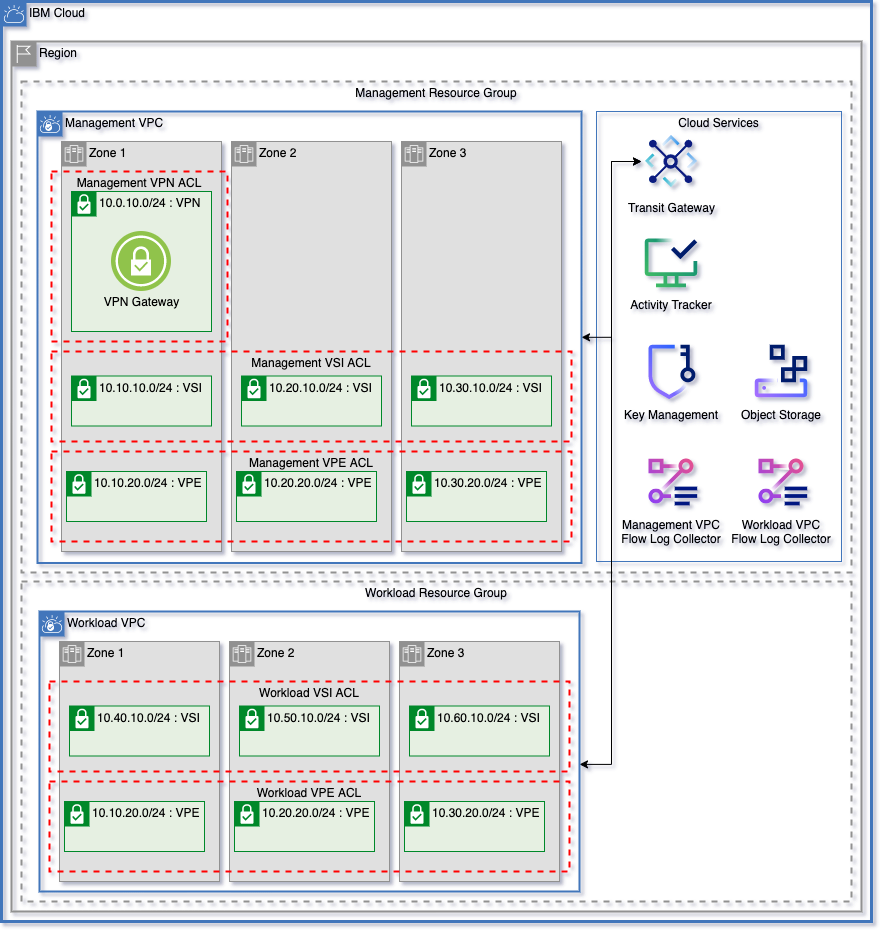
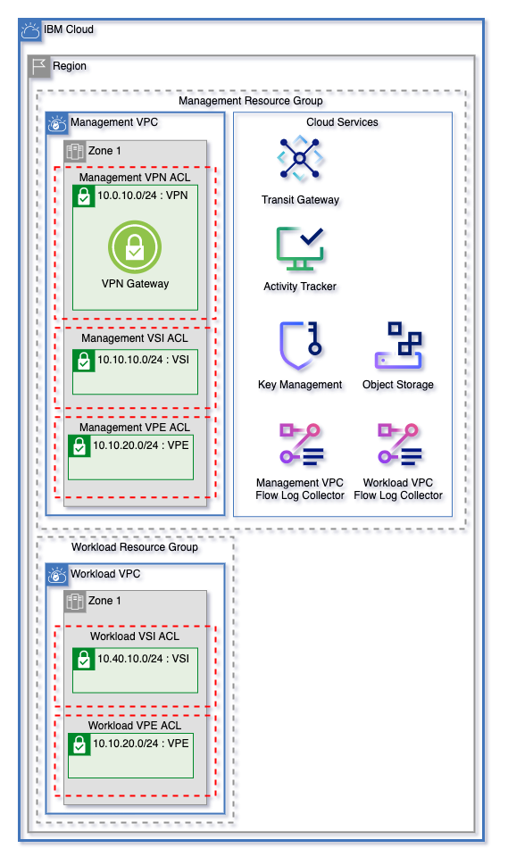

# IBM Cloud Solution Engineering Flexible VPC Network Template

Create flexible VPC networks in 1, 2, or 3 zones using Flow Logs and encrypted Cloud Object Storage buckets with a minimal input template.



---

## Table of Contents

1. [VPC Configuration](#vpc-configuration)
    - [Flexible Network Expansion](#easily-expand-your-architecturefrom-one-to-three-zones)
    - [Network Subnet CIDR Configuration](#network-subnet-cidr-configuration)
    - [Adding Public Gateways](#adding-public-gateways)
    - [Adding VPN Gateways](#adding-vpn-gateways)
2. [Transit Gateway](#transit-gateway)
3. [Network Access Control Lists](#network-access-control-lists)
    - [Cluster Rules](#cluster-rules)
4. [Cloud Services](#cloud-services)
    - [Key Management](#key-management)
        - [Using HPCS](#optional-use-an-existing-hyper-protect-crypto-services-instance-for-key-management)
    - [Cloud Object Storage](#cloud-object-storage)
5. [Logging and Monitoring](#logging-and-monitoring) 
    - [Flow Logs Collectors](#flow-logs-collectors)
    - [Atracker](#atracker)
6. [Naming Convention](#naming-convention)
7. [Template Variables](#template-variables)
8. [Template Outputs](#template-outputs)

---

## VPC Configuration

This template uses the following variables to configure Resource Groups, VPCs, network addresses, and subnet creation. A resource group will be dynamically created for each VPC.

Name                                | Type         | Description                                                                                                                                                                                  | Sensitive | Default
----------------------------------- | ------------ | -------------------------------------------------------------------------------------------------------------------------------------------------------------------------------------------- | --------- | ---------------------------------
zones                               | number       | Number of zones for each VPC. Can be 1, 2, or 3                                                                                                                                              |           | 3
vpc_names                           | list(string) | Names for VPCs to create. A resource group will be dynamically created for each VPC.                                                                                                         |           | `["management", "workload"]`
vpc_subnet_tiers                    | list(string) | List of names for subnet tiers to add to each VPC. For each tier, a subnet will be created in each zone of each VPC. Each tier of subnet will have a unique access control list on each VPC. |           | `["vsi", "vpe"]`
vpc_subnet_tiers_add_public_gateway | list(string) | List of subnet tiers where a public gateway will be attached. Public gateways will be created in each VPC using these network tiers.                                                         |           | `["vpn"]`
vpcs_add_vpn_subnet                 | list(string) | List of VPCs to add a subnet and VPN gateway. VPCs must be defined in `var.vpc_names`. A subnet and address prefix will be added in zone 1 for the VPN Gateway.                              |           | `["management"]`

---

### Easily expand your architecturefrom one to three zones

Dynamically increase zones by increasing the `zones` variables. Networks are configured to ensure that network addresses within this template won't overlap.

One Zone | Three Zones
---------|-------------
 | 

---

### Network Subnet CIDR Configuration

A subnet and network prefix are created for each subnet tier in `var.vpc_subnet_tiers` in each VPC. These subnets and network addresses dynamically created to allow for expansion and to ensure that network addresses don't overlap. Network addresses for each subnet tier are calculated using the following template:

```
10.x0.y0.0/24

x = (Index of VPC Name in `var.vpc_names` * 3) + zone
y = Index of subnet tier in `var.vpc_subnet_tiers` + 1
```

This formatting reserves IP Ranges to allow for adding additional zones in the future by increasing `var.zones` and additional subnet tiers by adding names to `var.vpc_subnet_tiers`

#### Two VPCs with two subnet tiers in a single zone

VPC        | Zone |  Subnet Tier | CIDR Block
-----------|------| -------------|----------
management | 1    |  vsi         | 10.10.10.0/24
management | 1    |  vpe         | 10.10.20.0/24
workload   | 1    |  vsi         | 10.40.10.0/24
workload   | 1    |  vpe         | 10.40.20.0/24

#### Two VPCs with two subnet tiers in three zones

VPC        | Zone |  Subnet Tier | CIDR Block
-----------|------| -------------|----------
management | 1    |  vsi         | 10.10.10.0/24
management | 1    |  vpe         | 10.10.20.0/24
management | 2    |  vsi         | 10.20.10.0/24
management | 2    |  vpe         | 10.20.20.0/24
management | 3    |  vsi         | 10.30.10.0/24
management | 3    |  vpe         | 10.30.20.0/24
workload   | 1    |  vsi         | 10.40.10.0/24
workload   | 1    |  vpe         | 10.40.20.0/24
workload   | 2    |  vsi         | 10.50.10.0/24
workload   | 2    |  vpe         | 10.50.20.0/24
workload   | 3    |  vsi         | 10.60.10.0/24
workload   | 3    |  vpe         | 10.60.20.0/24

---

### Adding Public Gateways

Public gateways can be attached to subnet tiers across each VPC by using the `vpc_subnet_tiers_add_public_gateway` variable. A public gateway will be created in each zone and will be attached to the desired subnets.

---

### Adding VPN Gateways

VPCs listed in the `vpcs_add_vpn_subnet` variable will have a subnet created in Zone 1 of that VPC, and a VPN Gateway created on that subnet. The CIDR block `10.0.x0.0/24` is reserved for VPN Gateways in each VPC.

---

## Transit Gateway

Use the following variables to manage Transit Gateway resources

Name                                | Type         | Description                                                                                                                                                                                  | Sensitive | Default
----------------------------------- | ------------ | -------------------------------------------------------------------------------------------------------------------------------------------------------------------------------------------- | --------- | ---------------------------------
enable_transit_gateway              | bool         | Create transit gateway                                                                                                                                                                       |           | true
transit_gateway_connections         | list(string) | List of VPC names from `var.vpc_names` to connect via a single transit gateway. To not use transit gateway, provide an empty list.                                                           |           | ["management", "workload"]

---

## Network Access Control Lists

A Network [Access Control List](https://cloud.ibm.com/docs/vpc?topic=vpc-using-acls) is created for each subnet tier in each VPC. Allow rules for all of these network ACLs are managed by the following variables:

Name                                | Type         | Description                                                                                                                                                                                  | Sensitive | Default
----------------------------------- | ------------ | -------------------------------------------------------------------------------------------------------------------------------------------------------------------------------------------- | --------- | ---------------------------------
add_cluster_rules                   | bool         | Automatically add needed ACL rules to allow each network to create and manage Openshift and IKS clusters.                                                                                    |           | true
global_inbound_allow_list           | list(string) | List of CIDR blocks where inbound traffic will be allowed. These allow rules will be added to each network acl.                                                                              |           | [ "10.0.0.0/8", "161.26.0.0/16" ]
global_outbound_allow_list          | list(string) | List of CIDR blocks where outbound traffic will be allowed. These allow rules will be added to each network acl.                                                                             |           | [ "0.0.0.0/0" ]
global_inbound_deny_list            | list(string) | List of CIDR blocks where inbound traffic will be denied. These deny rules will be added to each network acl. Deny rules will be added after all allow rules.                                |           | [ "0.0.0.0/0" ]
global_outbound_deny_list           | list(string) | List of CIDR blocks where outbound traffic will be denied. These deny rules will be added to each network acl. Deny rules will be added after all allow rules.                               |           | []

### Default Allow Rules

Name                                                     | CIDR            | Direction
---------------------------------------------------------|-----------------|----------
Allow all internal VPC network traffic                   | `10.0.0.0/8`    | Inbound
Allow inbound traffic from IBM private service endpoints | `161.26.0.0/16` | Inbound
Allow all outbound traffic                               | `0.0.0.0/0`     | Outbound

### Default Deny Rules

Name                                                     | CIDR            | Direction
---------------------------------------------------------|-----------------|----------
All not-allowed traffic                                  | `0.0.0.0/0`     | Inbound

### Cluster Rules

In order to make sure that clusters can be created on VPCs, by default the following rules are added to ACLs where clusters are provisioned. For more information about controlling OpenShift cluster traffic with ACLs, see the documentation [here](https://cloud.ibm.com/docs/openshift?topic=openshift-vpc-acls).

Rule                                               | Action | TCP / UDP | Direction | Source        | Source Port   | Destination   | Destination Port
---------------------------------------------------|--------|-----------|-----------|---------------|---------------|---------------|-------------------
Create Worker Nodes                                | Allow  | Any       | inbound   | 161.26.0.0/16 | any           | 10.0.0.0/8    | any
Communicate with Service Instances                 | Allow  | Any       | inbound   | 166.8.0.0/14  | any           | 10.0.0.0/8    | any
Allow Incling Application Traffic                  | Allow  | TCP       | inbound   | 10.0.0.0/8    | 30000 - 32767 | 10.0.0.0/8    | any
Expose Applications Using Load Balancer or Ingress | Allow  | TCP       | inbound   | 10.0.0.0/8    | any           | 10.0.0.0/8    | 443
Create Worker Nodes                                | Allow  | Any       | outbound  | 10.0.0.0/8    | any           | 161.26.0.0/16 | any
Communicate with Service Instances                 | Allow  | Any       | outbound  | 10.0.0.0/8    | any           | 166.8.0.0/14  | any
Allow Incling Application Traffic                  | Allow  | TCP       | outbound  | 10.0.0.0/8    | any           | 10.0.0.0/8    | 30000 - 32767
Expose Applications Using Load Balancer or Ingress | Allow  | TCP       | outbound  | 10.0.0.0/8    | 443           | 10.0.0.0/8    | any

---

## Cloud Services

This template creates the following resources:
- Key Protect
- Cloud Object Storage

These resources are created in the management resource group, the resource group where components for the first VPC in `var.vpc_names`.

---

### Key Management

This module by default creates a single Key Protect instance and an encryption key used for each Object Storage bucket created. A service authorization is also created to allow keys from this instance to be used to enrypt Block Storage for VPC.

#### (Optional) Use an existing Hyper Protect Crypto Services instance for key management

The following variables can be used to have keys and service authorizations use an existing HPCS instance.

Name                                | Type         | Description                                                                                                                                                                                  | Sensitive | Default
----------------------------------- | ------------ | -------------------------------------------------------------------------------------------------------------------------------------------------------------------------------------------- | --------- | ---------------------------------
existing_hs_crypto_name             | string       | OPTIONAL - Get data for an existing HPCS instance. If you want a KMS instance to be created, leave as `null`.                                                                                |           | null
existing_hs_crypto_resource_group   | string       | OPTIONAL - Resource group name for an existing HPCS instance. Use only with `existing_hs_crypto_name`.                                                                                       |           | null

---

### Cloud Object Storage

This template creates a single Cloud Object Storage instance. A service authorization policy is created to allow Object Storage buckets to be encrypted with the key management key. To prevent duplicate resource names, a randomized suffix can be added to all Object Storage resources by setting the `cos_use_random_suffix` variable to `true`.

#### Object Storage Buckets

An object storage bucket is created for each VPC for Flow Logs storage. If enabled, a bucket is also created for Atracker storage. Each bucket is encrypted using the key management encryption key.

---

## Logging and Monitoring

This template uses [Atracker](https://cloud.ibm.com/docs/activity-tracker?topic=activity-tracker-at_events) and [Flow Logs](https://cloud.ibm.com/docs/vpc?topic=vpc-flow-logs) for logging and monitoring services at the VPC level.

### Flow Logs Collectors

When each VPC is created it is attached to a Flow Logs Collector. Logs are stored in the corresponding Object Storage bucket.

### Atracker

By setting the `enable_atracker` variable to `true`, an Atracker target will be created. To add a route for Atracker, set the `add_atracker_route` variable to `true`. 

---

## Naming Convention

Each resource created using this template has the prefix in `var.prefix` prepended to the resource service instance name.

Resource Type               | Name Format
----------------------------|---------------
Resource Group              | `<prefix>-<vpc_name>-rg`
Object Storage              | `<prefix>-cos-<random_suffix>`
Object Storage Buckets      | `<prefix>-<vpc_name>-<flow-logs or atracker>-bucket-<random_suffix>`
Key Management              | `<prefix>-kms`
Key Management Key          | `<prefix>-bucket-key`
Transit Gateway             | `<prefix>-transit-gateway`
Transit Gateway Connections | `<prefix>-<vpc_name>-hub-connection`
Public Gateways             | `<prefix>-<vpc_name>-public-gateway-zone-<zone>`
Network ACLs                | `<prefix>-<vpc_name>-<subnet_tier_name>-acl`
Subnets                     | `<prefix>-<vpc_name>-<subnet_tier_name>-<zone>`
VPN Gateways                | `<prefix>-<vpc_name>-vpn-gateway`
VPCs                        | `<prefix>-<vpc_name>-vpc`
Flow Logs Collectors        | `<prefix>-<vpc_name>-flow-logs`
Atracker                    | `<<prefix>-atracker`

---

## Template Variables

Name                                | Type         | Description                                                                                                                                                                                  | Sensitive | Default
----------------------------------- | ------------ | -------------------------------------------------------------------------------------------------------------------------------------------------------------------------------------------- | --------- | ---------------------------------
ibmcloud_api_key                    | string       | The IBM Cloud platform API key needed to deploy IAM enabled resources.                                                                                                                       | true      | 
region                              | string       | The region to which to deploy the VPC                                                                                                                                                        |           | 
prefix                              | string       | The prefix that you would like to prepend to your resources                                                                                                                                  |           | 
tags                                | list(string) | List of Tags for the resource created                                                                                                                                                        |           | null
zones                               | number       | Number of zones for each VPC                                                                                                                                                                 |           | 3
vpc_names                           | list(string) | Names for VPCs to create. A resource group will be dynamically created for each VPC.                                                                                                         |           | ["management", "workload"]
vpc_subnet_tiers                    | list(string) | List of names for subnet tiers to add to each VPC. For each tier, a subnet will be created in each zone of each VPC. Each tier of subnet will have a unique access control list on each VPC. |           | ["vsi", "vpe"]
vpc_subnet_tiers_add_public_gateway | list(string) | List of subnet tiers where a public gateway will be attached. Public gateways will be created in each VPC using these network tiers.                                                         |           | ["vpn"]
vpcs_add_vpn_subnet                 | list(string) | List of VPCs to add a subnet and VPN gateway. VPCs must be defined in `var.vpc_names`. A subnet and address prefix will be added in zone 1 for the VPN Gateway.                              |           | ["management"]
enable_transit_gateway              | bool         | Create transit gateway                                                                                                                                                                       |           | true
transit_gateway_connections         | list(string) | List of VPC names from `var.vpc_names` to connect via a single transit gateway. To not use transit gateway, provide an empty list.                                                           |           | ["management", "workload"]
add_cluster_rules                   | bool         | Automatically add needed ACL rules to allow each network to create and manage Openshift and IKS clusters.                                                                                    |           | true
global_inbound_allow_list           | list(string) | List of CIDR blocks where inbound traffic will be allowed. These allow rules will be added to each network acl.                                                                              |           | [ "10.0.0.0/8", "161.26.0.0/16" ]
global_outbound_allow_list          | list(string) | List of CIDR blocks where outbound traffic will be allowed. These allow rules will be added to each network acl.                                                                             |           | [ "0.0.0.0/0" ]
global_inbound_deny_list            | list(string) | List of CIDR blocks where inbound traffic will be denied. These deny rules will be added to each network acl. Deny rules will be added after all allow rules.                                |           | [ "0.0.0.0/0" ]
global_outbound_deny_list           | list(string) | List of CIDR blocks where outbound traffic will be denied. These deny rules will be added to each network acl. Deny rules will be added after all allow rules.                               |           | []
existing_hs_crypto_name             | string       | OPTIONAL - Get data for an existing HPCS instance. If you want a KMS instance to be created, leave as `null`.                                                                                |           | null
existing_hs_crypto_resource_group   | string       | OPTIONAL - Resource group name for an existing HPCS instance. Use only with `existing_hs_crypto_name`.                                                                                       |           | null
enable_atracker                     | bool         | Enable activity tracker for this pattern.                                                                                                                                                    |           | true
add_atracker_route                  | bool         | Add a route to the Atracker instance.                                                                                                                                                        |           | false
cos_use_random_suffix               | bool         | Add a randomize suffix to the end of each Object Storage resource created in this module.                                                                                                    |           | true

---

## Template Outputs

The following are outputs of this template.

### `vpc_networks` Output

For each network an object is created in the `vpc_networks` output that contains the following data:
  - VPC ID
  - VPC CRN
  - VPC Name
  - Subnet Zone List
  - Network ACLs
  - Public Gateways
  - Security Groups
  - VPN Gateways


### Services Outputs

Name                 | Description
-------------------- | ---------------------------------------
key_management_name  | Name of key management service
key_management_crn   | CRN for KMS instance
key_management_guid  | GUID for KMS instance
key_rings            | Key rings created by module
keys                 | List of names and ids for keys created
cos_instances        | List of COS resource instances with shortname, name, id, and crn.
cos_buckets          | List of COS bucket instances with shortname, instance_shortname, name, id, crn, and instance id.

### Key Management Keys Output

The `keys` output is a list with the following fields for each Key Management Key:

Field Name | Field Value
-----------|----------------------------
shortname  | Name of key without prefix
name       | Composed name including prefix
id         | ID of the Key
crn        | CRN of the Key
key_id     | Key ID of Key

### COS Instances Output

The `cos_instances` output is a list with the following fields for each Object Storage Instances:

Field Name | Field Value
-----------|----------------------------
shortname  | Name of instance without prefix and random suffix
name       | Composed name including prefix and random suffix
id         | ID of the instance
crn        | CRN of the instance

### COS Buckets Output

The `cos_buckets` output is a list with the following fields for each Object Storage Bucket:

Field Name          | Field Value
--------------------|----------------------------
instance_shortname  | Shortname of the Object Storage instance where the bucket is created
instance_id         | Instance ID of the Object Storage instance where the bucket is created
shortname           | Name of bucket without prefix and random suffix
name                | Composed name including prefix and random suffix
id                  | ID of the Bucket
crn                 | CRN of the Bucket


### COS Resource Keys Output

The `cos_keys` output is a list with the following fields for each Object Storage Bucket:

Field Name          | Field Value
--------------------|----------------------------
instance_shortname  | Shortname of the Object Storage instance where the key is created
instance_id         | Instance ID of the Object Storage instance where the key is created
shortname           | Name of key without prefix and random suffix
name                | Composed name including prefix and random suffix
id                  | Resource Key ID
crn                 | Resource Key CRN